<!--
  Roary Pet — a fork of clawd-on-desk (https://github.com/rullerzhou-afk/clawd-on-desk),
  with the crab mascot replaced by Roary the lion (Roarbank mascot, © Fintech Farm).
  Licensed under AGPL-3.0-only, same as upstream. See NOTICE.md and themes/roary/README.md.
-->
<p align="center">
  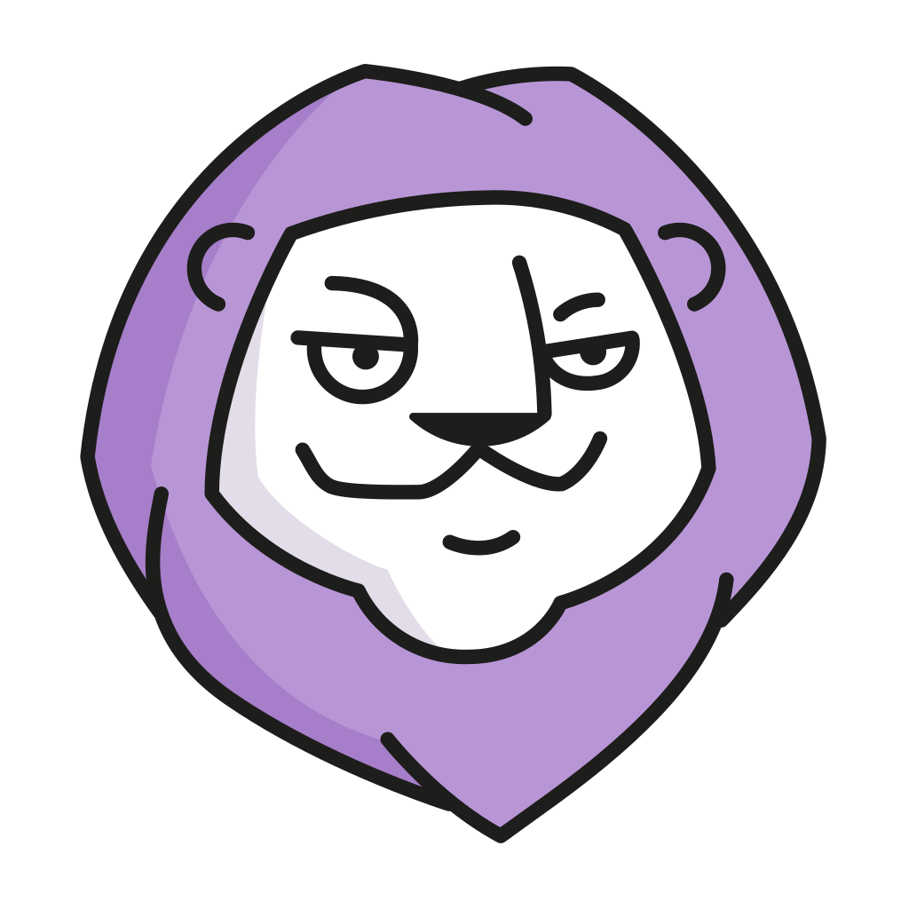
</p>
<h1 align="center">Roary Pet</h1>
<p align="center"><em>A desktop pet — Roary the lion — that reacts to your AI coding sessions in real time.</em></p>
<p align="center">
  <a href="https://github.com/AlexWolfGoncharov/roary-pet/releases"></a>
  
  
</p>

<p align="center">
  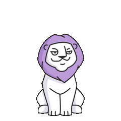
  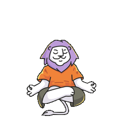
  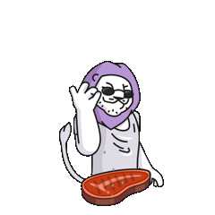
  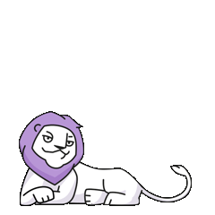
</p>

Roary lives on your desktop and reacts to what your AI coding agent is doing — in real time. Start a long task, walk away, and come back when Roary tells you it's done: he thinks when you prompt, works while tools run, juggles when subagents spawn, raises a permission bubble when approval is needed, roars and celebrates when a task completes, and sleeps when you step away.

Ships with **Roary** (the lion, default) plus the upstream themes **Clawd** (pixel crab), **Calico** (cat), and **Cloudling** — and full support for custom themes.

> Works with **Claude Code**, **Codex CLI**, **Copilot CLI**, **Gemini CLI**, **Cursor Agent**, **Antigravity**, **CodeBuddy**, **Kiro**, **Kimi**, **Qwen Code**, **CodeWhale**, **opencode**, **Pi**, **OpenClaw**, **Hermes**, **Qoder**, and **Reasonix**. Supports Windows 11 (x64/ARM64), macOS, and Linux.

> **Fork notice:** Roary Pet is a fork of [clawd-on-desk](https://github.com/rullerzhou-afk/clawd-on-desk) by Ruller_Lulu, with the crab mascot replaced by Roary (Roarbank's lion). Same AGPL-3.0 license. Localized for **English / Русский / Українська**.

## Animations

Roary's states (the other bundled themes are kept too):

<table>
  <tr>
    <td align="center"><br><sub>Idle</sub></td>
    <td align="center"><br><sub>Thinking</sub></td>
    <td align="center"><br><sub>Working</sub></td>
    <td align="center">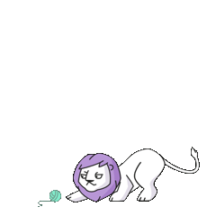<br><sub>Subagents</sub></td>
    <td align="center">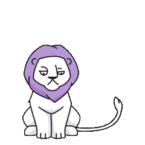<br><sub>Error</sub></td>
    <td align="center"><br><sub>Done</sub></td>
    <td align="center">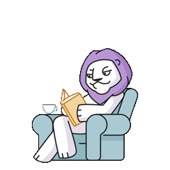<br><sub>Reading (idle)</sub></td>
    <td align="center">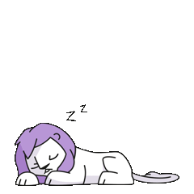<br><sub>Sleeping</sub></td>
  </tr>
</table>

<details>
<summary>Other bundled themes — Clawd (crab), Calico, Cloudling</summary>

<table>
  <tr>
    <td align="center"><br><sub>Clawd Idle</sub></td>
    <td align="center">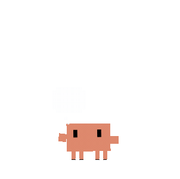<br><sub>Clawd Thinking</sub></td>
    <td align="center"><br><sub>Clawd Typing</sub></td>
    <td align="center"><br><sub>Clawd Building</sub></td>
    <td align="center"><br><sub>Clawd Juggling</sub></td>
  </tr>
  <tr>
    <td align="center">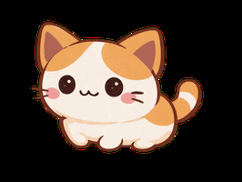<br><sub>Calico Idle</sub></td>
    <td align="center"><br><sub>Calico Thinking</sub></td>
    <td align="center"><br><sub>Calico Typing</sub></td>
    <td align="center"><br><sub>Calico Building</sub></td>
    <td align="center"><br><sub>Calico Juggling</sub></td>
  </tr>
  <tr>
    <td align="center">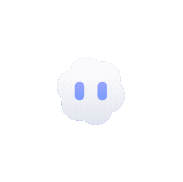<br><sub>Cloudling Idle</sub></td>
    <td align="center">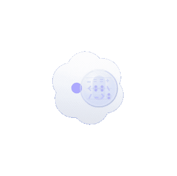<br><sub>Cloudling Thinking</sub></td>
    <td align="center">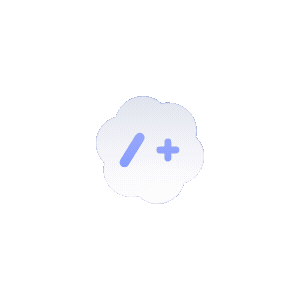<br><sub>Cloudling Typing</sub></td>
    <td align="center"><br><sub>Cloudling Building</sub></td>
    <td align="center"><br><sub>Cloudling Juggling</sub></td>
  </tr>
</table>

</details>

Full event-to-state mapping, mini mode, and click reactions: **[docs/guides/state-mapping.md](docs/guides/state-mapping.md)**.

## Features

- **Multi-agent, real-time** — agent hooks + log polling drive Roary's animations automatically across all supported agents; sessions are tracked independently and resolve to the highest-priority state.
- **Permission bubbles** — when an agent (Claude Code, Codex, CodeBuddy, opencode, …) requests a tool permission, Roary pops a floating Allow/Deny card instead of making you wait in the terminal. Hotkeys `Ctrl+Shift+Y` / `Ctrl+Shift+N`; per-agent toggle in Settings.
- **Eye tracking** — Roary follows your cursor while idle, with subtle body lean.
- **Free roam** — optional: Roary wanders the desk when idle (Settings → Appearance), stops when you move the mouse.
- **Sleep sequence & reactions** — yawns and dozes after a while; startled wake on mouse move; click/drag reactions.
- **Mini mode** — drag to the screen edge; Roary hides with peek-on-hover and alerts.
- **Sessions dashboard + HUD** — inspect live sessions, recent events, and jump to the terminal.
- **Mobile companion (PWA)** — mirror your sessions' live state on your phone over LAN (read-only, token-gated).
- **System** — click-through transparency, position memory, single-instance lock, Do Not Disturb, sound effects (incl. Roary's roar on completion), system tray.
- **i18n** — English, Русский, Українська. Switch in the tray or Settings.
- **Auto-update** — checks this repo's GitHub Releases. Windows installs updates on quit; macOS notifies and opens the release (until the build is code-signed).

## Quick Start

Download the latest prebuilt installer from **[GitHub Releases](https://github.com/AlexWolfGoncharov/roary-pet/releases/latest)**:

- **macOS**: `Roary-Pet-<version>-arm64.dmg` (Apple Silicon) or `-x64.dmg` (Intel)
- **Windows**: `Roary-Pet-Setup-<version>-x64.exe` or `-arm64.exe`
- **Linux**: `.AppImage` or `.deb`

> The macOS build is **unsigned** — on first launch right-click the app → **Open** → **Open**, or run `xattr -dr com.apple.quarantine "/Applications/Roary Pet.app"`.

**Claude Code** and **Codex CLI** work out of the box (hooks auto-register on launch). Install other agent integrations from **Settings → Agents**. Setup details, remote SSH, and per-platform notes: **[docs/guides/setup-guide.md](docs/guides/setup-guide.md)**.

Run from source (for development):

```bash
git clone https://github.com/AlexWolfGoncharov/roary-pet.git
cd roary-pet
npm install
npm start
```

Cutting releases (CI builds + publishes installers on a `v*` tag): **[docs/RELEASING.md](docs/RELEASING.md)**.

## Custom Themes

Roary Pet supports custom themes — replace the default lion with your own character and animations.

```bash
node scripts/create-theme.js my-theme       # scaffold
node scripts/validate-theme.js themes/my-theme   # validate
```

Edit `theme.json`, drop your assets (SVG / GIF / APNG / WebP / PNG / JPG) into `assets/`, then pick the theme in **Settings → Theme**. Full guide: **[docs/guides/guide-theme-creation.md](docs/guides/guide-theme-creation.md)**. The Roary theme's own asset/sound mapping is documented in **[themes/roary/README.md](themes/roary/README.md)**.

> Third-party SVG files are automatically sanitized for security.

## License

Source code is licensed under the [GNU Affero General Public License v3.0](LICENSE) (AGPL-3.0), same as the upstream project.

**Artwork and bundled theme assets are NOT covered by AGPL-3.0** — all rights reserved by their respective holders:

- **Roary** the lion is the Roarbank mascot, © **Fintech Farm**. Roary artwork and the `themes/roary/` theme are © Fintech Farm.
- This project is a fork of **[clawd-on-desk](https://github.com/rullerzhou-afk/clawd-on-desk)** © Ruller_Lulu ([@rullerzhou-afk](https://github.com/rullerzhou-afk)) — thanks for the original work.
- **Clawd** character © [Anthropic](https://www.anthropic.com) (unofficial fan art; not affiliated). **Calico** and **Cloudling** artwork by 鹿鹿 ([@rullerzhou-afk](https://github.com/rullerzhou-afk)), all rights reserved.
- The Roary roar sound is from [Mixkit](https://mixkit.co) (Mixkit Free License). See [NOTICE.md](NOTICE.md).

**No cryptocurrency.** This project has no token, coin, NFT, or airdrop.
</content>
